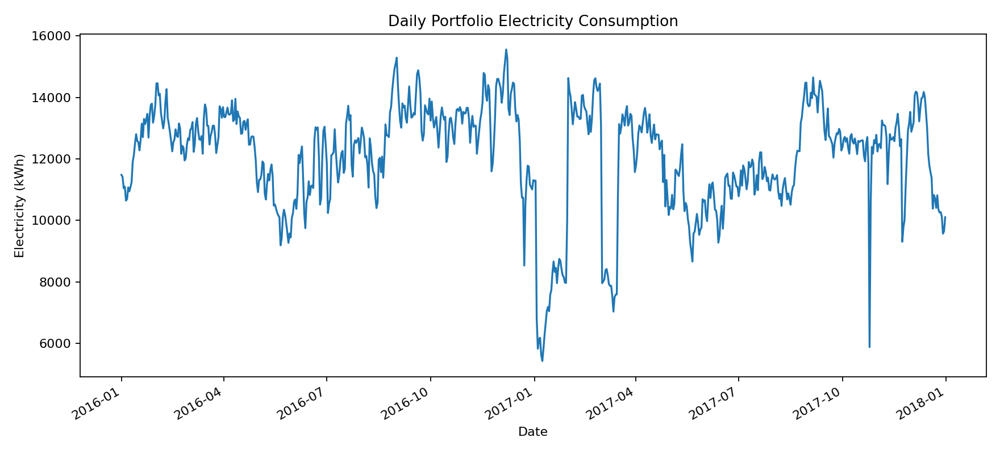

# Results Summary

This is a generated sample result from the current analysis run. The raw meter,
metadata and weather files are not committed because the electricity file is
large, but the code recreates these outputs from the public Building Data Genome
Project 2 dataset.

## Portfolio Snapshot

- Rows analysed: 166,552
- Buildings analysed: 10
- Period: 2016-01-01 00:00:00 to 2017-12-31 23:00:00
- Total electricity: 8,839,782 kWh
- Estimated CO2: 1,829,835 kg CO2e
- Daily anomaly flags: 226
- Weekly naive forecast MAE: 7.00 kWh
- Top out-of-hours candidate: Bear_lodging_Dannie, with 68.2% average out-of-hours share

## Interpretation

The analysis creates a practical monitoring view from building meter data:
overall demand trend, high and low daily anomalies, out-of-hours consumption and
a simple short-term baseline forecast.

The output is deliberately transparent. The IQR anomaly rule, generic
out-of-hours logic and weekly naive forecast are easy to explain, test and
replace with stronger methods once real operating schedules and business rules
are available.

## Example Chart

## Recommended Next Checks

- Confirm whether high out-of-hours readings match real occupancy or operating schedules.
- Investigate high anomaly days against weather, holidays and site events.
- Replace the illustrative CO2 factor with the correct reporting factor for the target region and year.
- Add building operating hours where available instead of using a generic night/weekend rule.
